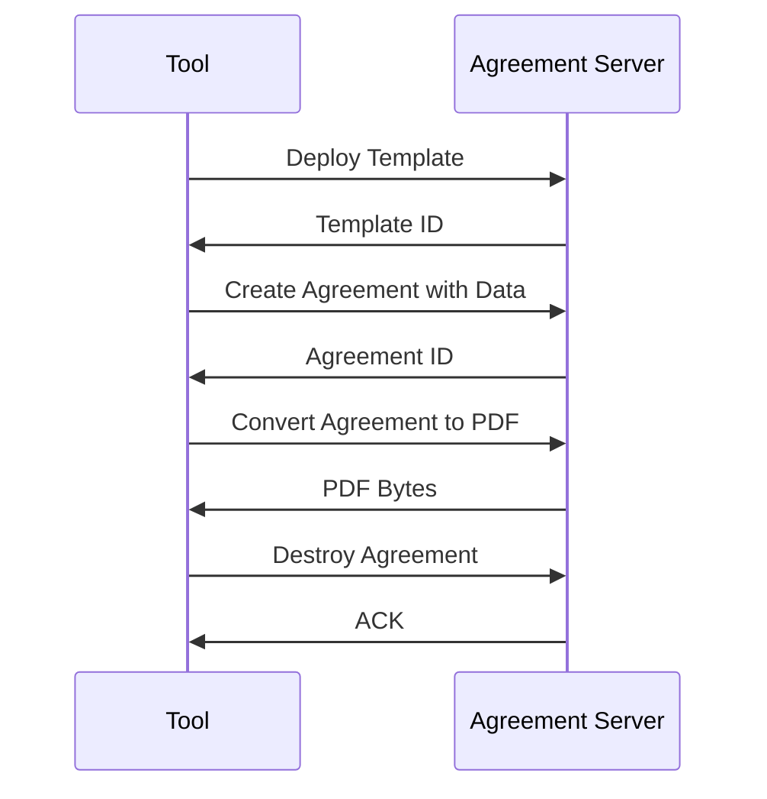

# Accord Project Agreement Protocol

The Accord Project Agreement Protocol (APAP) defines the protocol used between a document generation engine or contract management platform and an agreement server that provides agreement features like template management, document generation, format conversion etc.

## What is the Agreement Protocol?

Adding features like document generation, data format conversion for a document generation template language takes significant effort. Traditionally this work had to be repeated for each template format, as each format provides different APIs for implementing the same feature.

An Agreement Server is meant to provide the template-specific smarts and communicate with agreement tools over a protocol that enables inter-process communication.

The idea behind the Agreement Protocol (APAP) is to standardize the protocol for how such servers and agreement tools communicate. This way, a single Agreement Server can be re-used in multiple agreement tools, which in turn can support multiple templates with minimal effort.

APAP is a win for both template providers and agreement tooling vendors!

## How it Works

An agreement server runs as a separate process and agreement tools communicate with the server using the agreement protocol over REST. Below is an example for how a tool and an agreement server communicate during a routine document generation session:

## Capabilities

Not every agreement server can support all features defined by the protocol. APAP therefore provides ‘capabilities’. A capability groups a set of agreement features. An agreement tool and the agreement server announce their supported features using capabilities.

Notice the actual integration of an agreement server into a particular tool is not defined by the agreement protocol and is left to the tool implementors.

## Libraries (SDKs) for APAP providers and consumers

To simplify the implementation of agreement servers and clients, there are libraries or SDKs:

Development tool SDKs each development tool typically provides a library for integrating agreement servers. Generated client code for various platforms is available in the [client](./client/) directory.

## Reference Implementation

A reference implementation of the protocol is available in the [server](./server) directory.
