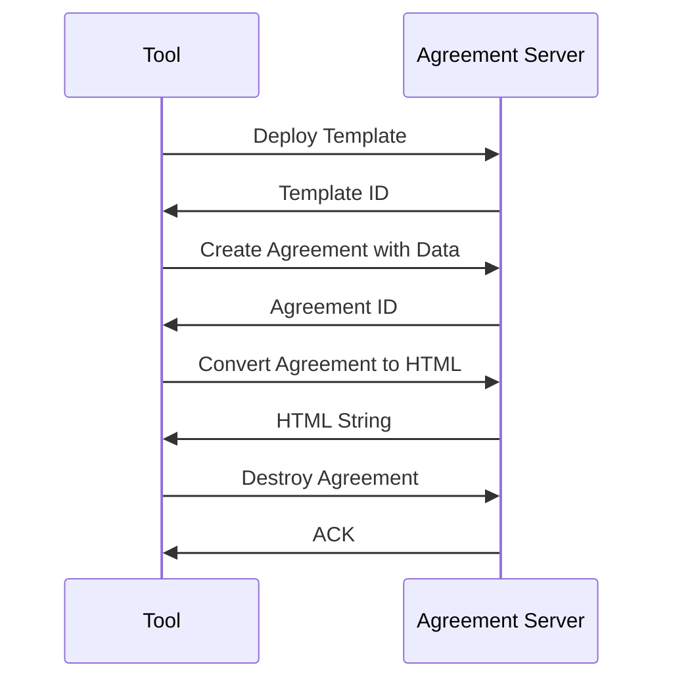

# Accord Project Agreement Protocol

The Accord Project Agreement Protocol (APAP) defines the protocol used between a document generation engine or contract management platform and an agreement server that provides agreement features such as: template management, document generation, format conversion etc.

## What is the Agreement Protocol?

Adding features like document generation, data format conversion for a document generation template language takes significant effort. Traditionally this work had to be repeated for each template format, as each format provides different APIs for implementing the same feature.

The APAP Agreement Server provides the template-specific smarts and communicate with agreement tools over a protocol that enables inter-process communication.

The Agreement Protocol (APAP) standardizes the protocol for how such servers and agreement tools communicate. This way, a single Agreement Server can be re-used in multiple agreement tools, which in turn can support multiple templates with minimal effort.

APAP is a win for both template providers and agreement tooling vendors!

## How it Works

An agreement server runs as a separate process and agreement tools communicate with the server using the agreement protocol over REST. Below is an example for how a tool and an agreement server communicate during a routine document generation session:


```mermaid
sequenceDiagram
    participant T as Tool
    participant S as Agreement Server
    T->>S: Deploy Template
    S->>T: Template ID
    T->>S: Create Agreement with Data
    S->>T: Agreement ID
    T->>S: Convert Agreement to HTML
    S->>T: HTML String
    T->>S: Destroy Agreement
    S->>T: ACK
```
## Capabilities

Not every agreement server can support all features defined by the protocol. APAP therefore provides ‘capabilities’. A capability groups a set of agreement features. An agreement tool and the agreement server announce their supported features using capabilities.

Notice the actual integration of an agreement server into a particular tool is not defined by the agreement protocol and is left to the tool implementors.

## Libraries (SDKs) for APAP providers and consumers

To simplify the implementation of agreement servers and clients, there are libraries or SDKs:

Generated client code for various platforms is available in the [client](./client/) directory.

## Reference Implementation

A reference implementation of the protocol is available in the [server](./server) directory.

## Quick Start

### Run locally with Docker

```bash
git clone https://github.com/accordproject/apap.git
cd apap/server
cp .env_example .env
docker compose up
```

The server starts at `http://localhost:9000`. On first run, bootstrap the database schema in a separate terminal:

```bash
cd apap/server && npx drizzle-kit push
```

### Deploy on Railway

Click the button below to provision the server and a managed Postgres instance in one click:

[](https://railway.com/deploy/QYiXk5?referralCode=Gx6QTA&utm_medium=integration&utm_source=template&utm_campaign=generic)

Once deployed, your server is available at the Railway-assigned URL (e.g. `https://my-apap.up.railway.app`). No database setup required — Postgres is provisioned and linked automatically. Important note: this deployment is a sample implementation and not hardened for a production implementation. 

### Verify

```bash
curl http://localhost:9000/capabilities
# or https://my-apap.up.railway.app/capabilities
```


For full API documentation see [docs.accordproject.org/docs/ref-apap](https://docs.accordproject.org/docs/ref-apap).
